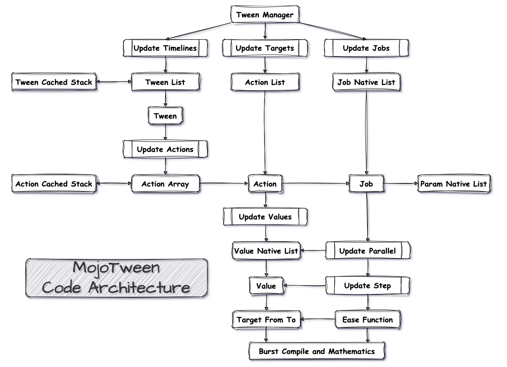

## MojoUnity-Tween v1.0

MojoUnity-Tween is an amazing Tween animation Engine, highly optimized for `C#` and `Unity`, coded with the new technologies such as `Burst`, `Jobs`, `Collections`, `Mathematics` and more.

The engine provides a complete set of solutions for applying Tween to all aspects of `Unity Objects`, as well as visualizing the running details of Tweens through the `Editor UI`.

The implementation code is concise, clear and easy to understand, has detailed comments，uses `#region` for organization, and easy to customize and extend.

The package has rich code samples and detailed usage docs.

## Features

#### Ease Functions:

* Supports fully standard `easeInOut` effects.
* Supports extra effects such as `Smooth`, `ShakeXYZ`, `BezierQuadraticXYZ`, `BezierCubicXYZ` and more.
* Optimizes all functions based on `Burst` and `Mathematics` APIs.
* Uses expression expansion whenever possible to optimize functions.

#### Animate Everything:

* `Transform` can perform Tween with `Move`, `Scale`, `Rotate`, `Shake Position / Scale / Rotation`, `Bezier Quadratic / Cubic Move`.
* `RectTransform` can perform Tween with `Anchored`, `OffsetMax`, `OffsetMin`, `sizeDelta`.
* `Graphic` can perform Tween with `Fade`, `Color`, `RGB`.
* `CanvasGroup` can perform Tween with `Fade`.
* `SpriteRenderer` can perform Tween with `Fade`.
* `AudioSource` can perform Tween with `Volume`.
* `Material` can perform Tween with `Float`, `Int`, `Vector`, `Color`.

#### Tween Control Methods:

* Supports queued and concurrent actions in one Tween with `Append`, `AppendInterval`, `AppendCallback`, `AppendIntervalCallback`, `Add`, `AddWithDelay`, `AddDelayCallback`, `AddAfterAppend` and more.
* Supports Tween `Play`, `Rewind`, `Restart`, `GotoStart`, `Reverse`, `Stop`, `Pause` and more.
* Supports rich Tween state test with `IsPlaying`, `IsRewinding`, `IsPaused`, `IsStopped`, `IsCompleted`, `IsRecycled` and more.
* Supports various Tween callback bindings with `SetOnStart`, `SetOnComplete`, `SetOnStop`, `SetOnRecycle` and more.
* Supports Tween default ease and relative settings.
* Supports chained calls to set properties.

#### Tween Action Control Methods:

* Supports ease action with `Float`, `Vector2`, `Vector3`, `Vector4`.
* Supports independent callback with `SetOnStart`, `SetOnComplete`.
* Supports ease and relative for each action value with `SetRelativeAt`, `SetEaseAt`.
* Supports custom params with `SetExtraParams`.
* Supports chained calls to set properties.

#### Tween Manager Control Methods:

* Supports updating Tweens `StopAll`, `RestartAll`, `ReverseAll`, `RewindAll`, `PauseAll`, `TogglePauseAll`, `RecycleAll` and more.
* Supports native data release.

#### Performance & Cache:

* All Tweens will be cached and reused, no need to manually manage the memory data.
* All Tween actions have independent cache-reuse.
* All values of all actions are cached by `NativeList` and used by `Jobs`.
* All ease functions and action values settings are optimized with `BurstCompile` and `Unsafe Code` and `Mathematics` APIs.

#### Tween Runtime Info:

* Integrates an Editor extension to easily and quickly extend the `Inspector` and `Window`.
* All Tweens runtime info can be visited through the `Editor UI`.

#### Customize & Extend:

* The engine code is highly cohesive and low coupling, with clear hierarchy and easy to expand.
* Many engine public APIs are implemented based on the extension of the core code, so it is very natural and smooth to customize your own function extensions with the core code.
* All engine extensions use `C# (static this) Extension Methods`, which makes it convenient and fast to use.

#### Supported OS:

In theory any platform that Unity supports.

## Code Architecture

## Issues & Discussions

* Any bugs can go to [[Issues]](https://github.com/scottcgi/MojoUnity-Tween/issues) for feedback.
* Any questions or comments can go to [[Discussions]](https://github.com/scottcgi/MojoUnity-Tween/discussions) for exchange.
